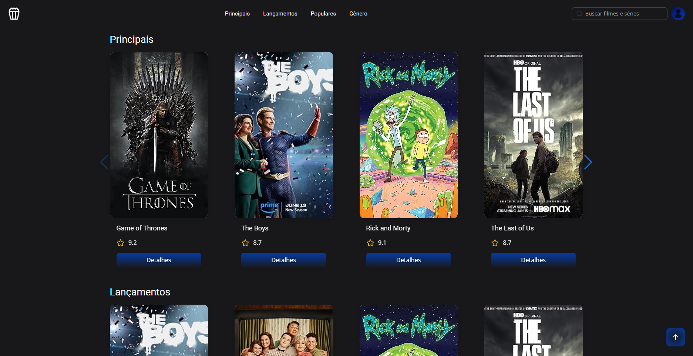
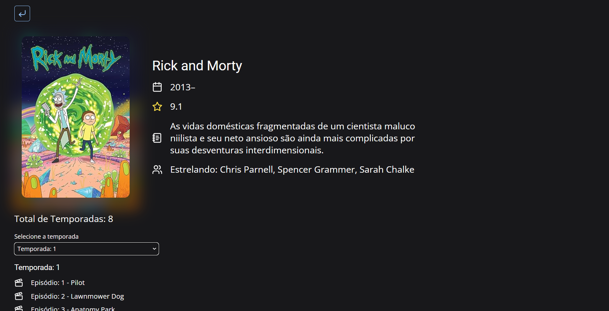

# React Films




React Films is a frontend project developed with React + TypeScript that integrates with the backend  [Java Films](https://github.com/topics/movies?l=java) to display information about TV series in an interactive and intuitive way.

## Features

### Main Titles Display:
- The homepage showcases the most popular series titles, capturing user attention.
### Latest Releases:
- A dedicated section for the latest series releases, keeping users updated with the newest content.
### Top 5:
- A list of the top 5 highest-rated series, helping users discover new content.
### Category Navigation:
- The ability to filter series by category, making it easier to search for specific genres.
### Title Search:
- A search bar allows users to quickly find the desired series.
### Series Details:
- Clicking on a series directs the user to a page with complete details, such as synopsis, cast, seasons, and episodes.
### Seasons and Episodes:
- Each series displays its seasons and episodes, with information about release date, synopsis, and rating.

## Technologies Used

- React: A JavaScript library for building declarative and efficient user interfaces.
- TypeScript: A superset of JavaScript that adds static typing, enhancing code reliability and readability.
- Vite: A modern development tool that offers fast startup, hot reload, and other features to optimize workflow.
- React Router DOM: A library for managing page routing in a React application, enabling smooth navigation without reloading.
- Tailwind CSS: A CSS framework that provides a utility-first system for quickly styling components and interfaces.
- Java Films API: The backend interface used to retrieve series information.

## Usage Instructions

1. Clone the Repository:
```bash
git clone https://github.com/LeonardoSardagna/reactFilms.git
```
2. Navigate to the project directory:
```bash
cd reactFilms
```
3. Install dependencies:
```bash
npm install
```
5. Run the application:
```bash
npm run dev
```
5. Access the application in the browser:
-Abra um navegador web e acesse a URL `http://localhost:5173`.

## Notes
- This project is a frontend interface that consumes APIs provided by the Java Films backend.
- Ensure that the Java Films backend is running and accessible for the frontend to fetch series data.
- The application uses React, TypeScript, and other modern libraries to provide a rich and responsive user experience.
